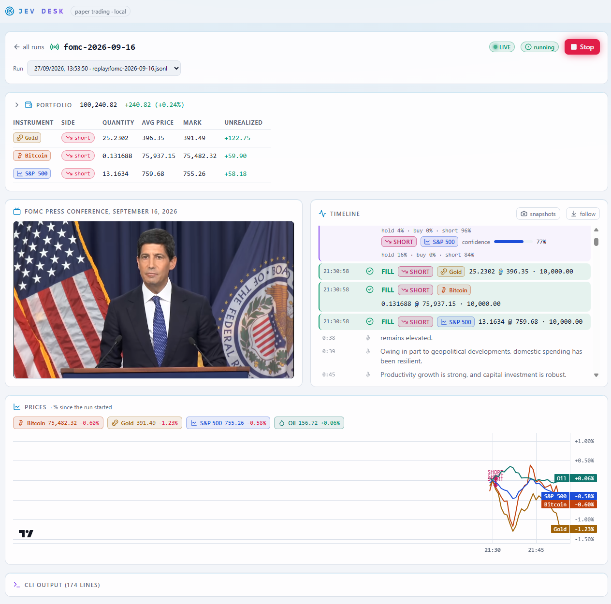
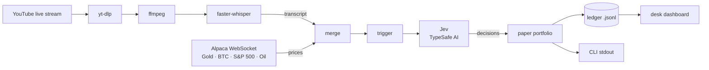

# JevOnAir

JevOnAir monitors livestreams in real time, transcribes speech, detects market-moving
statements with Jev, and turns them into structured simulated trade signals.

> **Disclaimer:** JevOnAir is a research and paper-trading tool. It never places real orders,
> and nothing it produces is financial advice.



_Jev Desk: the video, Jev's timeline of decisions and fills, the paper portfolio and the prices
it traded on._

## How it works

Speech from a live stream is transcribed as it happens, merged with live prices, and handed to
Jev, whose decisions are applied to a simulated portfolio.



## What's inside

- Command-line app in `apps/cli` (Node.js 24, TypeScript run directly)
- Local dashboard in `apps/desk` (Next.js): start/stop `jev` runs and watch them live
- Shared tooling: oxlint, Prettier, TypeScript 7, Turbo
- `@repo/logger` — structured JSON logging for Cloud Run / Cloud Logging
- `@repo/alpaca` — live Gold, Bitcoin, S&P 500 and Oil prices from Alpaca
- `@repo/transcriber` — YouTube → faster-whisper live transcript
- `@repo/jev` — the decision engine: transcript + prices → Jev (TypeSafe AI) → simulated portfolio
- pnpm catalog for versions, with a 14-day release-age guard on new releases
- Agent settings in `.claude/`, CI in `.github/`

```text
apps/cli               Node.js 24 CLI: transcribe, prices, jev
apps/desk              local Next.js dashboard: start/stop jev runs, watch them stream
packages/alpaca        Alpaca market data: live prices over WebSocket
packages/jev           paper-trading decision engine, portfolio and ledger
packages/transcriber   yt-dlp → ffmpeg → faster-whisper transcript stream
packages/logger        pino logger, Cloud Logging shaped JSON
tooling/prettier       shared Prettier config
tooling/typescript     shared tsconfig presets (base, node, react)
tooling/github         composite action: pnpm + Node + install; secrets-scan script
.oxlintrc.json         single root lint config for the whole repo
```

## Getting started

Requires Node.js 24.12.0 (`.nvmrc`) and pnpm 11.24.0 (`packageManager` in `package.json`).

```bash
pnpm install
pnpm cli --hello-world    # prints a greeting
```

## Quick start

Paper-trade a YouTube live stream with Jev. Needs [uv](https://docs.astral.sh/uv/) and
`ffmpeg` on `PATH`, Alpaca API keys (a paper-trading account's keys work) and a TypeSafe AI
API key.

```bash
pnpm install
cp .env.example .env   # fill in ALPACA_API_KEY_ID, ALPACA_API_SECRET_KEY and TYPESAFE_API_KEY
pnpm cli jev "https://www.youtube.com/watch?v=VIDEO_ID" --language=en
```

Replace `VIDEO_ID` with the ID of a live stream. Jev's decisions and simulated fills print to
stdout and are appended to `apps/cli/.cache/jev/<video-id>.jsonl`; Ctrl+C stops the run. See
[`apps/cli/README.md`](apps/cli/README.md) for replaying a recording and backtesting a past
event.

Or use the dashboard, which starts the same runs and shows them live (see
[`apps/desk/README.md`](apps/desk/README.md)):

```bash
pnpm desk   # http://127.0.0.1:3000
```

## Commands

```bash
pnpm lint           # type-aware linting, whole repo in one oxlint process
pnpm typecheck      # TypeScript 7 (tsc) across the repo
pnpm test           # test suite
pnpm build          # production builds
pnpm format         # Prettier write
pnpm format:check   # Prettier check (CI gate)
pnpm secrets:scan   # gitleaks secret scan over git history
```

oxlint prints nothing when there are no findings, so silent output means clean.

CI runs typecheck, lint, format-check, test, build and a gitleaks secret scan on push to
`main` and on PRs. `secrets:scan` needs either `gitleaks` v8.19+ on PATH or a running
Docker daemon.
